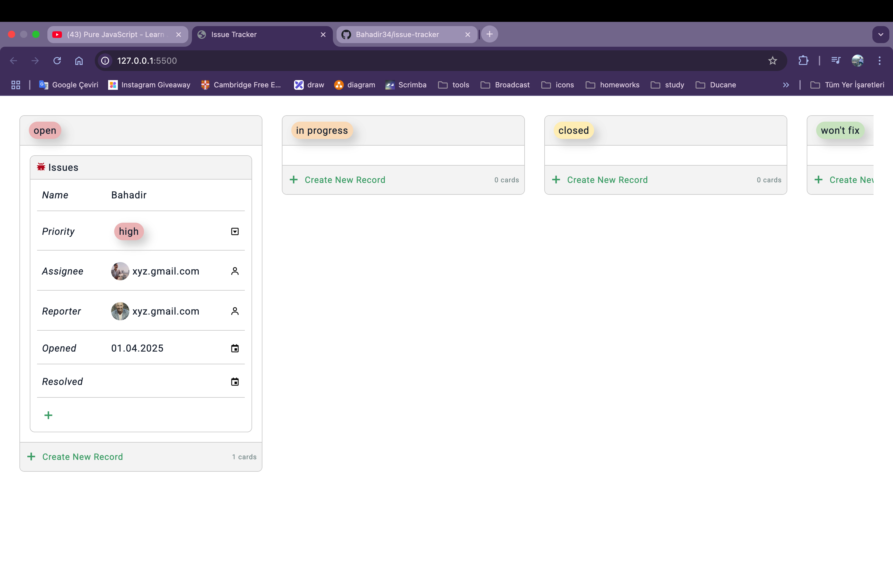
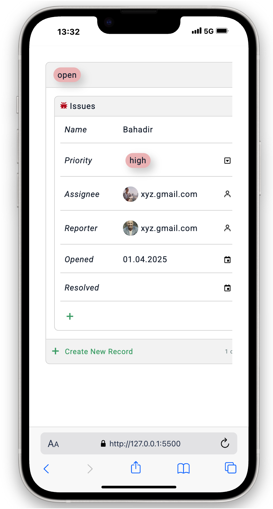
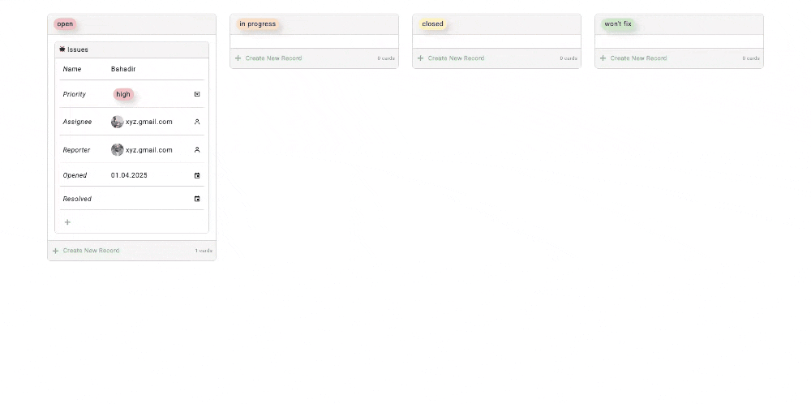

# Issue Tracker Uygulaması

Bu proje, kullanıcıların sorun (issue) ekleyip takip edebileceği **Issue Tracker** isimli bir web uygulamasıdır. **HTML**, **CSS**, **SCSS** ve **JavaScript** kullanılarak geliştirilmiş olup **tamamen responsive** ve **dinamik** bir yapıya sahiptir.

## ✨ Özellikler

* **Responsive Tasarım**: Tüm cihazlarda uyumlu kullanıcı arayüzü.
* **Dinamik İçerik**: JavaScript ile etkileşimli özellikler.
* **Issue Ekleme**: Kullanıcılar yeni issue girişi yapabilir.
* **Issue Takibi**: Mevcut sorunların durumu takip edilebilir.
* **SCSS Desteği**: Daha düzenli ve sürdürülebilir stil yönetimi.
* **Boxicons Entegrasyonu**: [boxicons.com](https://boxicons.com/) sitesinden alınan modern ve şık ikonlar ile kullanıcı arayüzü zenginleştirildi.

## 📚 Kullanılan Teknolojiler

* **HTML5**
* **CSS3**
* **SCSS**
* **JavaScript**

## 🚀 Kurulum

Projeyi çalıştırmak için aşağıdaki adımları izleyin:

1. Bu repoyu klonlayın:

   ```bash
   git clone https://github.com/Bahadir34/issue-tracker.git
   ```
2. Proje klasörüne gidin:

   ```bash
   cd issue-tracker
   ```
3. `index.html` dosyasını tarayıcınızda açın.

## 🖼️ Ekran Görüntüleri




## 👤 Katkıda Bulunma

Projeye katkıda bulunmak isterseniz **pull request** açabilirsiniz.

## 🌐 Canlı Önizleme



---

_Bu proje eğitim amaçlı geliştirilmiştir ve ticari bir amacı bulunmamaktadır._
